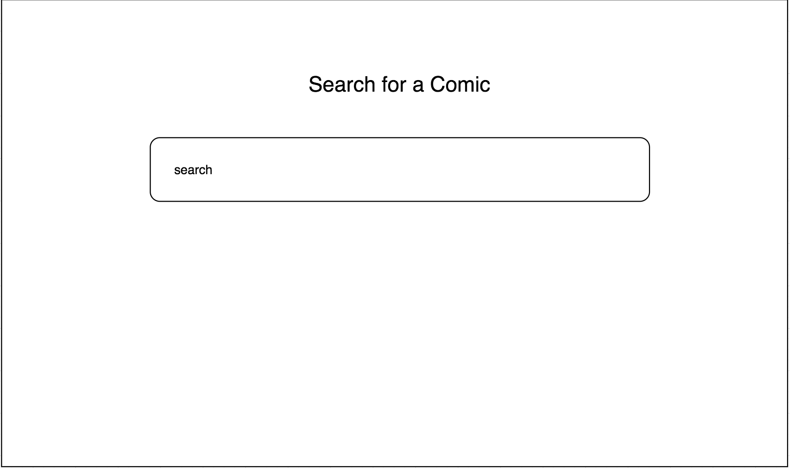
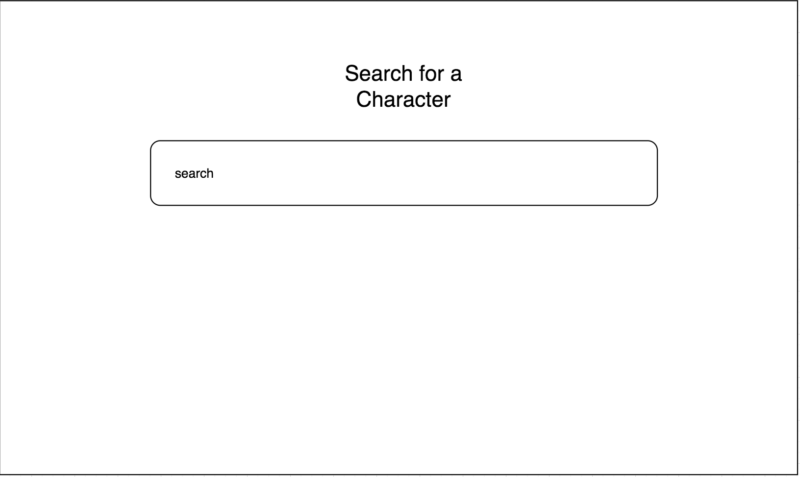
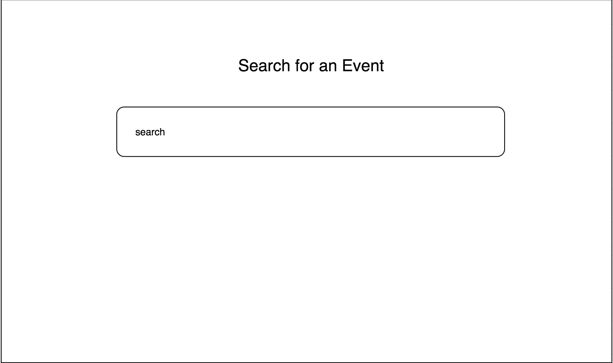
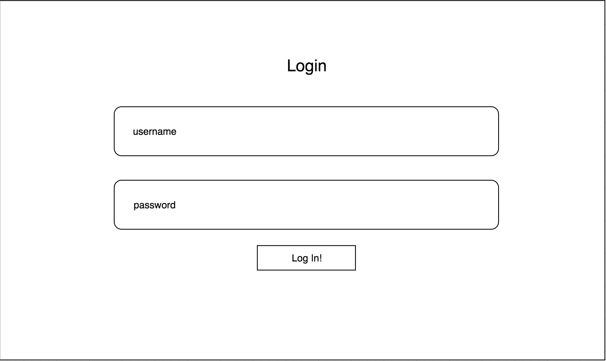
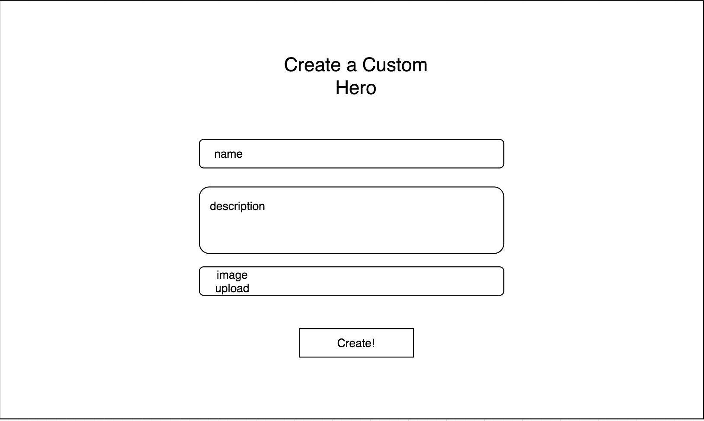
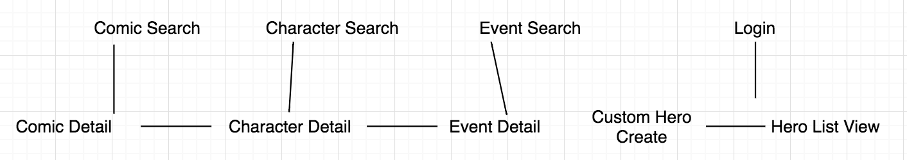

# All Things Superheroes! 

## Overview

All Things Superheroes is a web app which allows users to find any comic series, comic book character, comic issue or comic event that the user could ask for.* 

Users can also register and login to add their own superhero, and keep a list of their creations! Users will give their superheroes names and can supply a short summary of the character and an image of the character.

Note: * -> only Marvel or DC!


## Data Model

The application will store Users, Comics, Characters, Events, and Custom Heroes.

* users can have multiple custom heroes through references to them
* comics will have characters and events through referring to them
* characters will have references to comics and events through the comic and event titles, 
* custom heroes will have references to the user that created them


An Example User:

```javascript
{
  username: "heromaker1",
  hash: // a password hash,
  customHeroes: // an array of references to customHero documents
}
```

An Example Comic with references to Characters and Events:

```javascript
{
  title: "Super Comic #1",
  issueNumber: 3,
  description: "Super McCooper goes undercover as a superhero!",
  image: //path
  characters: //list of character names and the links leading to the characters
  events: //list of event names and links leading to the events
}
```

An Example Character:

```javascript
{
  name: "Spider-Man",
  description: "A guy who crawls like a spider",
  comics: // list of comic names and links leading to those comics
  events: // list of event names and links leading to those events
}
```

An Example Event:

```javascript
{
  title: "Spider-Man",
  description: "A guy who crawls like a spider",
  comics: // list of comic names and links leading to those comics
  characters: // list of characters who were there at event
}
```

A Custom Hero:

```javascript
{
  name: "My Custom Guy",
  description: "A guy who crawls like a spider",
  image: //path
  user: // reference to user
}
```


## [Link to Commented First Draft Schema](db.js) 

## Wireframes

/search/comic - page for searching for comics



/search/characters - page for searching for characters



/search/events - page for searching for events



/login - page for logging in



/create - page for creating custom hero



/list - page for showing list of custom heroes


## Site map



## User Stories or Use Cases

1. as a non-registered user, I can register a new account with the site
2. as a non-registered user, I can search for a comic character, comic book, or notable comic event
3. as a user, I can log in to the site
4. as a user, I can create a custom hero
5. as a user, I can add my hero to a list of already existing custom heroes

## Research Topics

(5 points) Integrate user authentication
  -will try to incorporate users local to the site in addition to social media logins
(3 points) Perform client side form validation using custom JavaScript or JavaScript library
(1 - 6 points) Use a client-side JavaScript library or module that we did not cover in class (not including any from other requirements)
  -will try to incorporate vue.js
(1 - 6 points) Per external API used
  -marvel developer api, dc comics api

min: 10 points
max: 20 points


## [Link to Initial Main Project File](./src/allThingsSuperheroes/app.js) 


## Annotations / References Used

