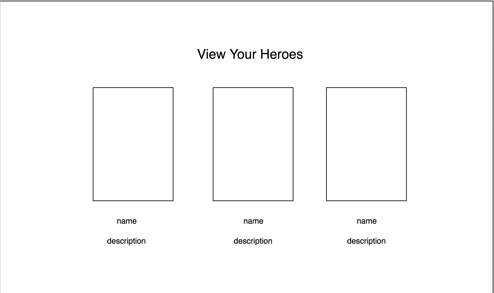

# All Things Superheroes! 

## Overview

All Things Superheroes is a web app which allows users to find any comic series, comic book character, comic issue or comic event that the user could ask for.* 

Users can also register and login to add their own superhero, and keep a list of their creations! Users will give their superheroes names and can supply a short summary of the character and an image of the character.

Note: * -> only Marvel or DC * *!
      * * -> DC API is discontinued so only Marvel


## Data Model

The application will store Users and Custom Heroes.

* users can have multiple custom heroes through references to them
* custom heroes will have references to the user that created them


An Example User:

```javascript
{
  username: "heromaker1",
  hash: // a password hash,
}
```

A Custom Hero:

```javascript
{
  name: "My Custom Guy",
  description: "A guy who crawls like a spider",
  image: //path
  user: // username of associated user
}
```

The application uses external APIs to get info about comics, so that information is not stored in the database


## [Link to Commented First Draft Schema](db.js) 

## Wireframes

/search/comic - page for searching for comics


/search/characters - page for searching for characters


/search/events - page for searching for events


/login - page for logging in


/create - page for creating custom hero


/list - page for showing list of custom heroes



## Site map


## User Stories or Use Cases

1. as a non-registered user, I can register a new account with the site
2. as a non-registered user, I can search for a comic character, comic book, or notable comic event
3. as a user, I can log in to the site
4. as a user, I can create a custom hero
5. as a user, I can add my hero to a list of already existing custom heroes

## Research Topics

(5 points) Integrate user authentication
  -registration local to the site is implemented
(3 points) Perform client side form validation using custom JavaScript or JavaScript library
  -use both joi and mongoose validator to have user log in
(1 - 6 points) Use a client-side JavaScript library or module that we did not cover in class (not including any from other requirements)
  -vue.js
(1 - 6 points) Per external API used
  -marvel developer api
(2 points) Integrate ESLint / JSHint / JSLint into your workflow
  -followed standard javascript style
(2 points) Use a CSS framework throughout your site, use a reasonable of customization of the framework
  -Buefy

min: 14 points
max: 24 points


## Annotations / References Used

-- Marvel API Documentation
-- Vue.js Documentation, Vuex
-- Stack Overflow
-- W3 Schools (templating)
-- Buefy Documentation
-- Joi Docs (github)

